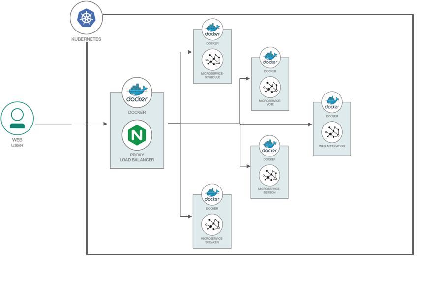

# IBM Cloud Discovery - Kubernetes Lab

# Lab 2
[Deploy based Java microservices on Kubernetes.](https://github.com/etribas/IBMDiscoveryLab.git)



# Prerequisite
* IBM Cloud Account
* Cluster

# Steps
1. [Build a nginx custom image](#1-clone-the-repo)
2. [Deploy nginx on K8s]
3. [Create database secrets]
4. [Deploy apps on K8s]
5. [Access Your Application]
6. [Delete everything]

### 1. Build a nginx custom image 
```
$ cd nginx
$ docker build -t registry.ng.bluemix.net/<YOUR_NAMESPACE>/custom-nginx .
$ docker push registry.ng.bluemix.net/<YOUR_NAMESPACE>/custom-nginx

//Check image on IBM Container Registry
$ ibmcloud cr images
```

### 2. Deploy nginx on K8s
* Modify *deploy-ingress.yaml* to use your image
```
# deploy-ingress.yaml
  spec:
    containers:	           
      - image: registry.ng.bluemix.net/<namespace>/custom-nginx # replace with your image name
```

* Create from yaml file
```
$ kubectl create -f deploy-ingress.yaml
```

### 3. Create database secrets
```
$ kubectl create secret generic cloudant-secret --from-literal=dbUsername=admin --from-literal=dbPassword="RHGPC2B17iUhGP_ruiG7ciE4lSrlNXEe"
```

### 4. Deploy apps on K8s
```
cd ..
//Database
$ kubectl create -f deploy-cloudant.yaml
//Schedule App
$ kubectl create -f deploy-schedule.yaml
//Session App
$ kubectl create -f deploy-session.yaml
//Speaker App
$ kubectl create -f deploy-speaker.yaml
//Vote App
$ kubectl create -f deploy-vote.yaml
//Front-End App
$ kubectl create -f deploy-webapp.yaml
```

### 5. Access Your Application
```
//Check cluster name
$ ibmcloud cs clusters	

//Check external IP Adress
$ ibmcloud cs workers <cluster-name>

//Check NodePort
$ kubectl get services
$ kubectl describe service custom-ingress-service
```

* On your browser, go to `http://<your-cluster-IP>:<NodePort>`

### 6. Delete everything
```
$ kubectl delete -f deploy-cloudant.yaml
$ kubectl delete svc,deploy,ingress -l app=microprofile-app
```

# Reference
https://github.com/IBM/Java-MicroProfile-on-Kubernetes
