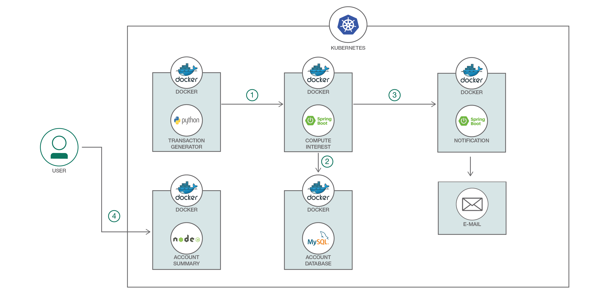

# IBM Cloud Discovery - Kubernetes Lab

# Lab 1
[Build and deploy apps on Kubernetes](https://github.com/etribas/IBMDiscoveryLab.git)



# Prerequisite
* IBM Cloud Account
* Java Development Kit (JDK)	
* [Maven](https://maven.apache.org/download.cgi)

# Steps
1. [Clone the repo](#1-clone-the-repo)
2. [Create a Cluster](#2-create-a-cluster)
3. [Install IBM Cloud CLI + Tools]
4. [IBM Cloud CLI Login]
5. [Create a namespace]
6. [Create the Database service]
7. [Build projects using Maven]
8. [Build Docker images]
9. [Deploy the Microservices]
10. [Access Your Application]
11. [Delete everything]

### 1. Clone the repo 
```
$ git clone https://github.com/etribas/CloudLab.git
```

### 2. Create a Cluster
* https://console.bluemix.net
* IBM Cloud Console Admin > Containers > Create Cluster
* Location: US South
* Cluster Type: Free
* Cluster name: myCluster

### 3. Install IBM Cloud CLI + tools
>Windows
```
$ Set-ExecutionPolicy Unrestricted; iex(New-Object Net.WebClient).DownloadString('http://ibm.biz/idt-win-installer')
```
>Linux
```
$ curl -sL https://ibm.biz/idt-installer | bash
```

### 4. IBM Cloud CLI Login
```
//Login IBM Cloud
$ ibmcloud login -a https://api.ng.bluemix.net   #usar -sso para federated ID	

//Set cloud foundry org/space
$ ibmcloud target --cf

//Set container service region
$ ibmcloud cs region-set us-south

//Command to get enviroment variable command
$ ibmcloud cs cluster-config mycluster

//Windows PowerShell
$env:KUBECONFIG = "C:\Users\<USER_HOME>\.bluemix\plugins\container-service\clusters\myCluster\kube-config-hou02-mycluster.yml"
//Linux
$ export KUBECONFIG=%HOMEPATH%\.bluemix\plugins\container-service\clusters\mycluster\kube-config-hou02-mycluster.yml

$ kubectl get all
```

### 5. Create a namespace
```
//Lista os namespaces
$ ibmcloud cr namespace-list

//Cria um namespace
$ ibmcloud cr namespace-add <my_namespace>
```

### 6. Create the Database service
```
$ kubectl create -f account-database.yaml

//Secrets
$ kubectl apply -f secrets.yaml
```

### 7. Build projects using Maven
```
$ containers/compute-interest-api/mvn install
$ containers/send-notification/mvn install
```

### 8. Build Docker images
```
//Build images
$ cd /Lab1
$ docker build -t registry.ng.bluemix.net/<YOUR_NAMESPACE>/compute-interest-api containers/compute-interest-api/.
$ docker build -t registry.ng.bluemix.net/<YOUR_NAMESPACE>/send-notification containers/send-notification/.

//Push images to IBM Cloud Container registry
$ docker push registry.ng.bluemix.net/<YOUR_NAMESPACE>/compute-interest-api
$ docker push registry.ng.bluemix.net/<YOUR_NAMESPACE>/send-notification
```

### 9. Deploy the Microservices

x
```yaml
# send-notification.yaml
  spec:
    containers:
      - image: registry.ng.bluemix.net/<namespace>/send-notification # replace with your image name
```
	
* Modify the **environment variables** in the `send-notification.yaml`:
```yaml
    env:
    - name: GMAIL_SENDER_USER
       value: 'username@gmail.com' # change this to the gmail that will send the email
    - name: GMAIL_SENDER_PASSWORD
       value: 'password' # change this to the the password of the gmail above
    - name: EMAIL_RECEIVER
       value: 'sendTo@gmail.com' # change this to the email of the receiver
```

* Create with yaml files
```
//Compute-interest-api
$ kubectl apply -f compute-interest-api.yaml

//send-notification
$ kubectl apply -f send-notification.yaml

//transaction-generator
$ kubectl apply -f transaction-generator.yaml

//Account summary (Front-End)
$ kubectl apply -f account-summary.yaml
```

### 10. Access Your Application
```
//Check cluster name
$ ibmcloud cs clusters	

//Check external IP Adress
$ ibmcloud cs workers <cluster-name>

//Check NodePort
$ kubectl get service account-summary
$ kubectl describe service account-summary
```

* On your browser, go to `http://<your-cluster-IP>:<NodePort>`

### 11. Delete everything
```
kubectl delete svc,deploy -l app=office-space
```

# Reference
https://github.com/IBM/spring-boot-microservices-on-kubernetes
